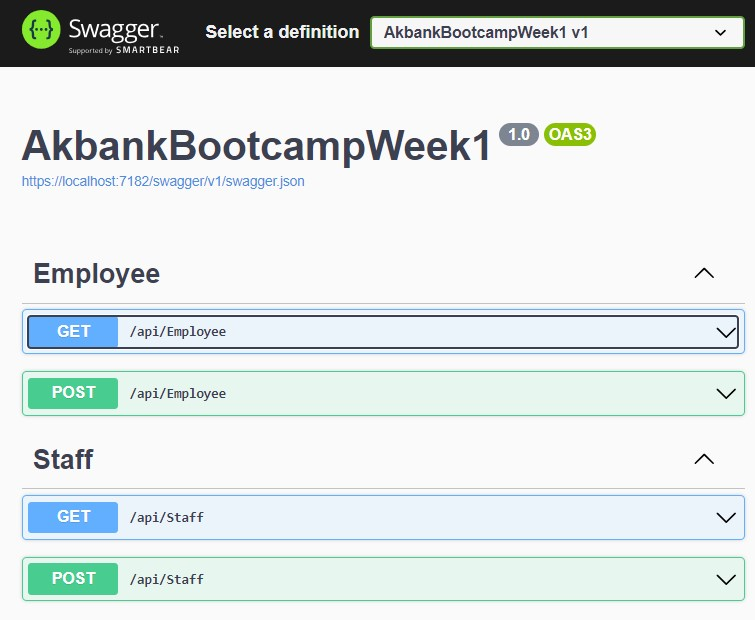

[](https://classroom.github.com/a/WZaiE2zH)

# Akbank .Net Bootcamp Ödevi
Akbank ve patikadev tarafından gerçekleştirilen Asp.Net eğitimi sürecinde verilen ilk ödev. Bu projede bizden Staff ve Employee controller icerisinde Staff ve Employee modellerin validasyonları Fluent validation ile yapmamız istendi. 

## Proje Yapısı ve Kod Blokları:
### Fluent Validaton paketinin eklenmesi:
- nuget paket yönetcisinden FluentValidation.AspNetCore paketi indirildi.
- FluentValidation.AspNetCore paketinin Startup.cs dosyasında configure edilmesi. 
    ```csharp
    public void ConfigureServices(IServiceCollection services)
    {
        // FluentValidation paketinin servislere eklenmesi.
        services.AddFluentValidation(conf =>
        {
            conf.RegisterValidatorsFromAssembly(typeof(Program).Assembly);
            conf.AutomaticValidationEnabled = false;
        });
    }
    ```
### Valdation için kullanılan sınıflar ve fonksiyonlar:
-   Staff ve Employee sınıflarının validation kurallarının tanımlandıgı StaffValidator ve EmployeeValidater sınıfları tanımlanmıştır.

    ```csharp
    public class StaffValidater : AbstractValidator<Staff>
    {
        public StaffValidater() 
        {
            // Validation kurallarının tanımları
        }
    }
    ```
-   Sınıfların validasyonu istenilen özellikleri için kurallar tanımlanır.

    ```csharp
    public StaffValidater() 
    {
        // Name özelliği için boş olmama, maksimum 250 karakter ve minimum 10 karekter uzunlugunda
        // olma kuralları tanımlandı.
        RuleFor(u => u.Name)
            .NotEmpty()
            .MaximumLength(250)
            .MinimumLength(10);
        /*
        *   Diger Kurallar
        */
        // HourlySalary özelliği için boş olmama ve maksimum 400 karakter ve minimum 30 degerinde
        // olma kuralları tanımlandı.
        RuleFor(u => u.HourlySalary).NotEmpty()
            .LessThan(400)
            .GreaterThan(30);
    }
    ```
-   Validation kuralları oluşturulurken standart kurallar kullanılabilir. Özel durumlar için fonksiyonlar geliştirilip dogrulamalar yapılabilir.
    ```csharp
    public StaffValidater() 
    {
        // Email özelliği için boş olmama ve email formatında olma kuralları tanımlandı.
        RuleFor(u => u.Email).NotEmpty()
            .Must(ValidateEmail);
    }
    // Email doğrulaması için kullanılan metot
    private bool ValidateEmail(string text)
    {
        var regex = new Regex(@"^([\w\.\-]+)@([\w\-]+)((\.(\w){2,3})+)$");
        return regex.IsMatch(text);
    }
    ```
- Validasyonun yapılmasında kullanılan kod parçaları. 
    ```csharp
    private readonly IValidator<Staff> _validator;
    public StaffController(IValidator<Staff> validator)
    {
        // dogrulama işleminde kullanılmak için _validator tanımlanır
        _validator = validator;
    }
    // Yeni staff eklemek için kullanılan metot
    [HttpPost]
    public ActionResult<Staff> Post([FromBody] Staff value)
    {
        // staff sınıfının dogrulaması yapılır 
        var validation = _validator.Validate(value);
        if (!validation.IsValid)
        {
            return BadRequest(validation.Errors);
        }
        return value;
    }
    ```
### DataGenerator Sınıfı:
- örnek verilerin kullanılması için oluşturduğum sınıf. Staff ve Employee verilerinden oluşan Listleri InitializeEmployee ve InitializeStaff metotları ile oluşturmaktadır.

## Projenin çalıştırılması:
- Geliştirme Ortamını Hazırlama:
Bilgisayarınızda .NET 6 SDK'sını yükleyin.
- Projenin İndirilmesi veya Klonlanması:
Proje GitHub gibi bir depoda ise, projeyi klonlayın veya ZIP dosyası olarak indirin.
- Projenin Çalıştırılması:
Projeyi Command Prompt üzerinden ' dotnet run ' komutu ile ve c# projeleri için kullandıgınız İde ile çalıştırabilirsiniz.
- Tarayıcıda Test Etme:
Proje başlatıldıktan sonra, tarayıcınızda veya API test araçlarında (Postman, Swagger gibi) https://localhost:<port>/ adresinde API'nin çalıştığını görebilirsiniz. (<port> varsayılan olarak 5001 veya 5000 olabilir)

## Swagger arayüzü:



